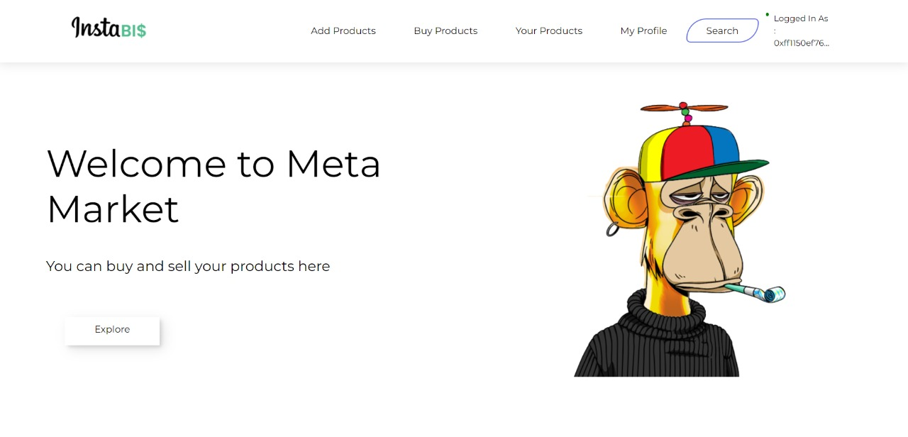

# Project Name : InstaBi$

## Link to working code in a public repo OR PR link to a public repo : https://github.com/sahildotexe/InstaBiz-dapp

## Recorded video demo of the integration : https://youtu.be/Lu77FVL84Cs

## Live URL with working integration : https://insta-biz.vercel.app/home

## Person of contact in case there are any questions : sahilkaling@gmail.com

## Discord ID : 0xsahil#6111

## UnstoppableDomain registered account email address: sahilkaling@gmail.com

## Code with Unstoppable login integration : https://github.com/sahildotexe/InstaBiz-dapp/blob/main/src/components/Layout.js

## Problem Statement ？

Design solutions for small businesses that can range from Management,
Inventory tracking, Sales, or any other such use-case for a specific small
business of your choice, from a domain of your choice.

## Idea 💡

In today's world, people are often reluctant to buy goods from small-scale sellers to avoid fraud. This affects the users as well as the sellers in many different ways.
Let's say a customer orders something and the sellers asks them to pay online, but later on the customer does not recieve the product.
Similarly a small scale business,which does not have enough funds to make its own payment portal or website can make itself seem more trustworthy to its customers, by using out application.

Our application empowers small-scale businesses by using the blockchain as well as machine learning techniques and connects them on social media platforms like Instagram. We have used smart contracts to ensure the integrity of the transactions carried out on the out platform.

## Our Approach 📍

The sellers can login via our portal through their metamask wallet and fill the necessary details. They can then list their products on our portal, the details of the product are stored on the polygon blockchain and the respective product images are stored using filecoin.

Similarly, the buyer can login through their metamask wallet and see all the listed products. They have an option to search for the required product. To buy the product the buyer has to send the required amount through their metamask wallet.
The customers will then be recommended products based on the ratings given by them and the users with similar . Our model uses a dataset of various users and finds out the most suitable recommendations for the user.
Our model is deployed as a flask API using app services on Azure.

## Future Scope 🔮

Collaborating up with delivery services and including a medium through which customers could interact with the ellers. We will also introduce features for influencers and allow people to follow their favourite sellers.
Adding Augmented and Virtual Reality technologies to allow people to try out various products at their home. People having similar interests could join to form communities or groups.

## Business Model 💸

Partnering up with named brands who could potentially sponsor us due to the nature of our application, having modern features like smart contracts and recommendation systems which only a very few competitors in the market have right now.

Coming up with a referral system which gives the user a discount of 20% for every 5 users invited by them.

Students typically are more sensitive to prices, as they have lower disposable income and so a small increase in price can make a good unaffordable. Therefore, we plan to offer special discounts to the students using our application

## Screenshots 📷

---

---

## Tech Stack 🛠

- Polygon
- Filecoin
- Solidity
- Truffle
- React.js
- Node.js
- Mongo DB
- Flask
- Microsoft Azure
- Pandas
- Saikit Learn

---
